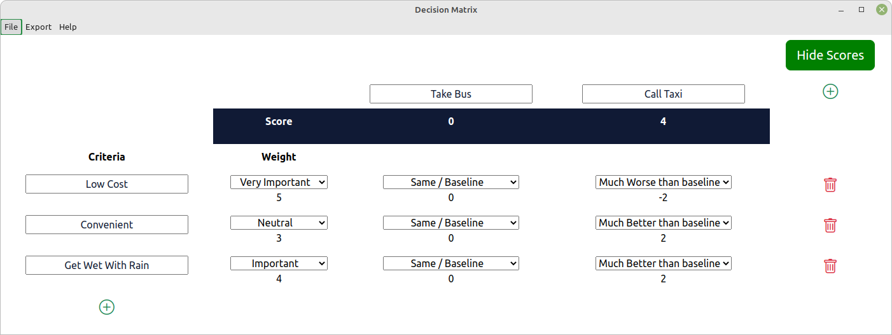

# Decision Matrix

## Overview

This application presents a decision matrix which can be exported to pdf or png.

## Motivation

[Electron](https://electronjs.org) is an application framweork that creates an [Chromium](https://chromium.org) and [Node.js](https://nodejs.org). I've wanted to put some time aside for a little while now to learn Electron, and I decided a simple business app would be a good start.

## Thoughts

I've learned the following points:

* Electron has some good tooling. It is reasonably straight forward to integrate unit tests, linters, packagers etc into the development workflow.
* I don't feel comfortable developing applications without strong static typing. This could be solved by including [TypeScript](https://www.typescriptlang.org/) into the build process.
* GUI testing feels "hacky". Here, I've placed a Chromedriver target into package.json to stand-up a server instance, and made calls to Selenium-Webdriver from Mocha (perhaps I've not odne hings the best way).
* Final packages are disproportionately large for otherwise simple appplications. Each dependency installed adds a tree of dependencies, that all seem to get packaged.
* Applications can be slow to start compared to true platform-native applications.

Overall, not my favourite framework for the above reasons. I can see how Electron has a place when there is a requirement for a cross-platform application and the development team is strongest in web technologies.
